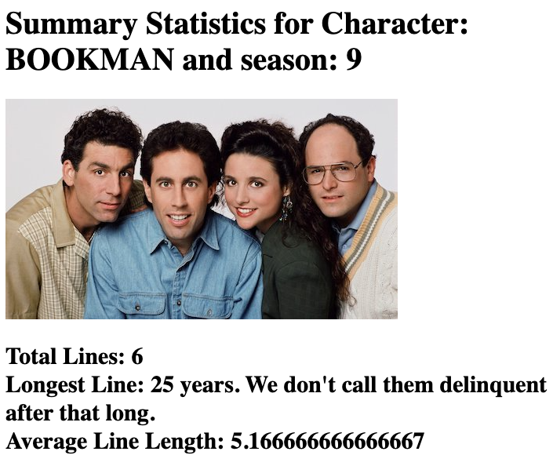
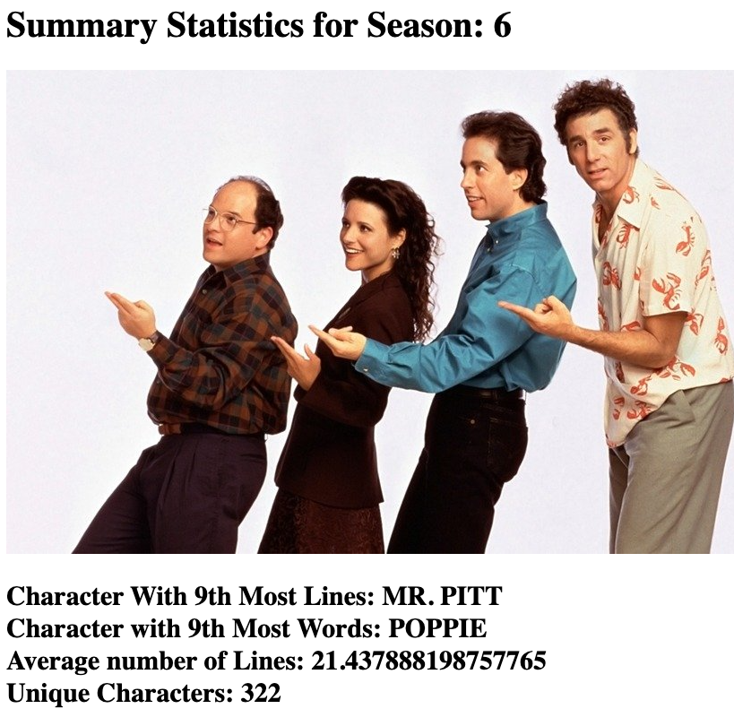

# CS2910 - Assignment-01
## An Assignment About Nothing

You heard it here, Seinfeld is making a comeback. But there are details that need to be worked out first. How much is each actor going to be paid, and how do they argue their worth to the show?

Should George be paid more than Elaine? How about Bania versus Puddy?

The actors have contacted you to create a website for them so they can use a data-driven approach to solve their money demands.

They request some simple data to help them make their arguments. The actors (characters) would like to know their:

 - longest line (in terms of words)
 - average line length (in words)
 - total number of lines

They would like this information for any given season or all the seasons (1-9) of the show combined.

Similarly, they would also like to know:

- the character with the X'th most lines in a season (X between 1 and the count of unique characters in the show)
- the character having the X'th most words in a season (X between 1 and the count of unique characters)
- the average number of lines for a character in the show
- the count of unique characters

Again for each of these, they would like them for any given season, or for all of the seasons of the show combined.

In this assignment you will implement the back-end for a website that will display this statistical data about the Seinfeld TV show. You are given a comma separated values (CSV) file containing all of the lines from the Seinfeld show (all 9 seasons).

You must complete the `NothingService` class including the following two methods:

```java
/**
 * Process and retrieve the character statistics for a certain season
 * Preconditions: the data is loaded, + ... any others you require
 * Postconditions: TBD (fill this in once you have designed your solution)
 * @param character the character to calculate statistics for
 * @param season the season to calculate statistics for
 * @return CharacterStatistics object containing the required data
 */
public CharacterStatistics getStats(String character, int season)

/**
 * Process and retrieve the season statistics for a certain season
 * Preconditions: the data is loaded, + ... any others you require
 * Postconditions: TBD (fill this in once you have designed your solution)
 * @param season the season to calculate statistics for
 * @return SeasonStatistics object containing the required data
 */
public SeasonStatistics getStats(int season, int position)
```

The above methods should return either a `CharacterStatistic` or a `ShowStatistic` object, which contains the required information for displaying the webpages. Those classes are to be completed by you.

There are a number of unit-tests to ensure your code is working correctly using smaller and easier to read datasets.

You are expected to add additional classes / methods to aid readability and maintainability of your code. But you shouldn't alter the existing `NothingService` method headers since they are used by the other aspects of the website and the automated testing.

See below a sample data file (sample.csv) in the same format as the full seinfeld data
```ascii
6
0,ANDREW,JAVA is so awesome!,1,S01E01,1
1,CHRIS,I love java much more than perl.,1,S01E01,1
2,ANDREW,Well I might not go that far.,1,S01E01,1
3,CHRIS,Yeah you are right perl for the win.,1,S01E01,1
4,ANDREW,This is episode 1 of season 2,1,S02E01,2
5,CHRIS,This is episode 2 of season 2,2,S02E02,2
```

Aside from the first line which gives the total number of lines from the show that follow in the file. Each line (after the 1st) of the CSV is formatted with the following fields (each separated by a comma and each containing no commas in the field):

- line number in the file
- character name
- the line in the show
- episode
- season and episode name
- season

For example in the above sample the first line of the file is 6 that indicates that 6 lines will follow. The 2nd line of the file is:
`0,ANDREW,JAVA is so awesome!,1,S01E01,1`
The 0 indicates it is the first show line in the file, this is followed by ANDREW indicating character ANDREW has this line and then the line is "JAVA is so awesome!" followed by the episode number (1) a code to give the season and episode (S01E01) and finally the episode number (1). Obviously, some of the data about seasons and episodes has some redundancies (but that was how the data came).

If you look really closely you'll notice that the data file has some inconsistencies. For example the character names sometimes include actions. There is a `JERRY` character and a `JERRY (dialing)` character. We will consider them to be two separate characters for this assignment.

## Implementation details

- to keep things simple we will consider any characters separated by a space (" ") to be separate words and also any directions to be possible words in that line. e.g.:
`6,GEORGE,(on an imaginary microphone) Uh; no; not at this time.,1,S01E01,1`

In the above GEORGE line he is considered to have 10 words;
- (on, an, imaginary, microphone), Uh;, no;, not, at, this, time.

## Building the website (Launching the Application)

You are given a SpringBoot application. You should be able to build the website by clicking the run button in the `NothingApplication` file. Then open your favorite web browser and navigate to:

[http://localhost:8080](http://localhost:8080)

or to a specific landing page:

[http://localhost:8080/characterstats](http://localhost:8080/characterstats)

or [http://localhost:8080/seasonstats](http://localhost:8080/seasonstats)

or more specific:

[http://localhost:8080/characterstats?character=BOOKMAN&season=9](http://localhost:8080/characterstats?character=BOOKMAN&season=9)

You can alter the character=X and season=Y to be any valid X or Y (X is a valid name of a character from the CSV datafile and Y is a valid season 1-9).

or

[http://localhost:8080/seasonstats?season=2&position=11](http://localhost:8080/seasonstats?season=6&position=9)

You can alter the season to be any valid season and the position in the above to be any valid position (giving the stats on the character having the position'th most words or lines)

Example screenshot of [http://localhost:8080/characterstats?character=BOOKMAN&season=9](http://localhost:8080/characterstats?character=BOOKMAN&season=9):



Example screenshot of [http://localhost:8080/seasonstats?season=2&position=11](http://localhost:8080/seasonstats?season=6&position=9):



## Deliverables

Submissions are made by pushing your code to Github

Deliverable Due: **Friday November 25, 5pm**

Push your solution to your Github repository before the deadline.

## Grading

| Grade Item | Value | Notes|
|---|---|---|
|Code Readability| 3 | Self documenting code, course naming conventions, javadoc documentation for every method and class|
|Code Design / maintenance | 2 | Organization and classes, efficiency, robustness, maintenance|
|Higher Order Method / lambda | 1 | Does your solution include at least one higher order method or lambda |
| Functionality | 4 | Does your code pass all of the unit-tests|

You can run all the unit-tests at once using `gradle test` from the gradle menu, or by clicking the run button in the testing file for individual tests.

## Hints and Tips

- read the 3 classes carefully:
  - NothingService
  - CharacterStatistics
  - SeasonStatistics

The methods you need to implement are outlined and the method headers provided.

- don't miss the *easy* points, write self-documenting code, follow our naming conventions and include javadoc comments for every method and class including pre and post conditions
- There is 1 point available if you incorporate a higher order method or a lambda expression into your solution (highlight it with a comment so the graders can spot it).
- Don't be afraid to add new classes or helper methods to a class to improve readability, robustness and code maintenance

## Late submissions

Check the rules outlined in course syllabus.

## Academic Integrity

This is an individual assignment. Violation of any academic integrity policies including (but not limited to):
- plagiarism
- soliciting work from others
- sharing code related to the Assignment
- altering someone else's code to pass it off as your own
- helping a classmate by allowing them to examine your solution

Any violations result in a penalty of -100% of the assignment grade. For example if this assignment is worth 7.5% of the course grade. An act of academic dishonesty will result **not only in a grade of 0 on the assignment but a reduction of your final course grade by 7.5%.**  

## Regret Rule

As per the course syllabus the regret rule applies to this assignment. This allows you to realize a mistake and remove your submitted assignment during the late period via email to the professor. Any removed submissions would not receive any academic misconduct penalties.
